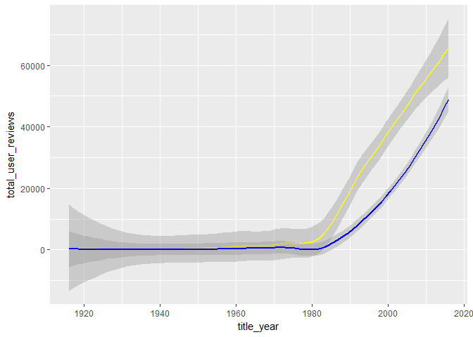
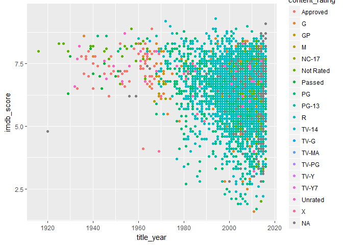
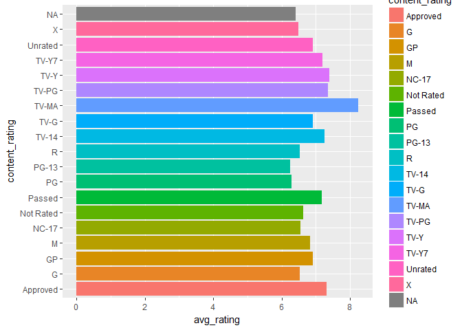
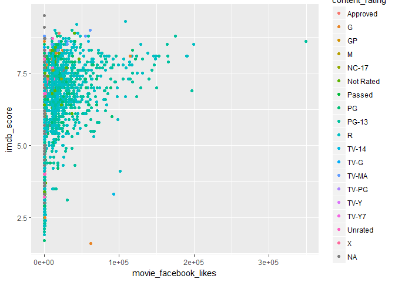
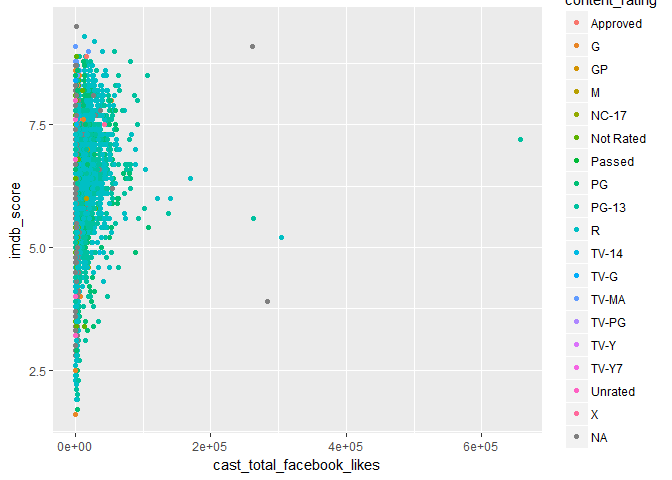
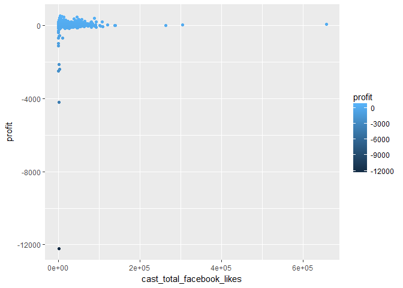
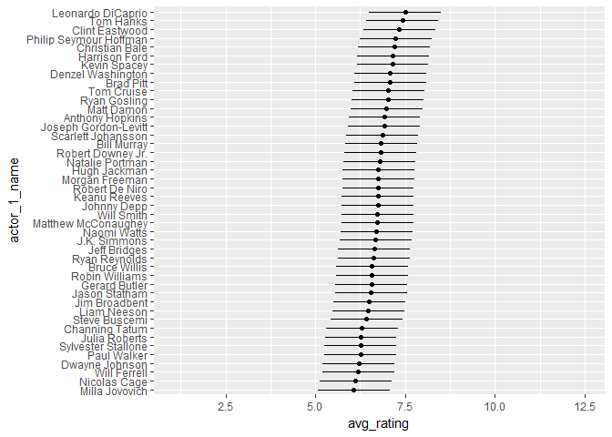

Untitled
================

Importing data, libraries
-------------------------

``` r
library(dplyr)
library(ggplot2)
library(knitr)
movie = read.csv("movie_metadata.csv",na.strings = '')

#colnames(movie)
movie = movie[,c(12,10,20,24,26,28,22,23,9,21,2,5,11,8,7,25,15,6,14,16,3,13,19)]

#str(movie)
#incomplete data
#nrow(movie[!complete.cases(movie),])
#column wise na s.
#colSums((!is.na(movie)))*100/nrow(movie)
```

-   The columns have been rearranged in a more logical fashion for better readability
-   the other data preprocessing steps have been included as comments

Total no of movies voted/reviewed per year
------------------------------------------

``` r
reviews_per_year = movie %>% group_by(title_year) %>% summarise(total_user_votes = sum(num_voted_users,na.rm=T), total_critics_reviews = sum(num_critic_for_reviews,na.rm=T), total_user_reviews = sum(num_user_for_reviews,na.rm=T))
kable(reviews_per_year[1:10,])
```

|  title\_year|  total\_user\_votes|  total\_critics\_reviews|  total\_user\_reviews|
|------------:|-------------------:|------------------------:|---------------------:|
|         1916|               10718|                       69|                    88|
|         1920|                   5|                        1|                     1|
|         1925|                4849|                       48|                    45|
|         1927|              111841|                      260|                   413|
|         1929|               11977|                      107|                   155|
|         1930|                3753|                       35|                    53|
|         1932|                3519|                       42|                    46|
|         1933|               12073|                      100|                   156|
|         1934|               64888|                      124|                   235|
|         1935|               13269|                       66|                    98|

``` r
ggplot(data = reviews_per_year) + geom_smooth(aes(x=title_year,y=total_user_reviews),colour = 'yellow') + geom_smooth(aes(x=title_year,y=total_critics_reviews),colour = 'blue') 
```

 - Total user reviews per year has been plotted by yellow line. - total critics reviews per year has been plotted with blue line. - starting from 1980s the number of user reviews for movies have surpassed critics ratings, thanks to the internet and personal computer!

average IMDb rating per year
============================

``` r
avg_rating_year = movie %>% group_by(title_year) %>% summarise(avg_imbd_rating = mean(imdb_score,na.rm=T)) 
kable(avg_rating_year[1:10,])
```

|  title\_year|  avg\_imbd\_rating|
|------------:|------------------:|
|         1916|               8.00|
|         1920|               4.80|
|         1925|               8.30|
|         1927|               8.30|
|         1929|               7.15|
|         1930|               7.80|
|         1932|               6.60|
|         1933|               7.10|
|         1934|               8.20|
|         1935|               7.80|

``` r
ggplot(data = movie) + geom_point(aes(x=title_year,y=imdb_score,colour = content_rating))
```

 - The classics from 1920s to 1940-50s have been mostly positively rated. whereas newer movies have recieved all kinds of reviews(low to high).

content wise scores
===================

``` r
content_score = movie %>% group_by(content_rating) %>% summarise(avg_rating = mean(imdb_score,na.rm=T))

ggplot() + geom_bar(data = content_score,aes(x=content_rating,y=avg_rating,fill = content_rating),stat= 'identity') + coord_flip()
```

 - tv programs seem to have highest average ratings! \#directors with highest imdb rating

``` r
popular_directors = movie %>% group_by(director_name) %>% summarise(fb_likes = first(director_facebook_likes)) %>% arrange(-fb_likes)
kable(popular_directors[1:10,])
```

| director\_name       |  fb\_likes|
|:---------------------|----------:|
| Joseph Gordon-Levitt |      23000|
| Christopher Nolan    |      22000|
| David Fincher        |      21000|
| Derick Martini       |      20000|
| Denzel Washington    |      18000|
| Kevin Spacey         |      18000|
| Martin Scorsese      |      17000|
| Clint Eastwood       |      16000|
| Quentin Tarantino    |      16000|
| Tom Hanks            |      15000|

facebook likes and imdb rating
==============================

``` r
ggplot() + geom_point(data = movie,aes(x=movie_facebook_likes,y=imdb_score,colour =content_rating)) + geom_smooth()
```



``` r
cor(movie$movie_facebook_likes,movie$imdb_score)
```

    ## [1] 0.2470485

how likes of cast related to movie rating?
==========================================

``` r
ggplot() + geom_point(data = movie,aes(x=cast_total_facebook_likes,y=imdb_score,colour =content_rating)) + geom_smooth()
```



``` r
cor(movie$cast_total_facebook_likes,movie$imdb_score)
```

    ## [1] 0.08578735

loss making films, group by category, other characteristics like cast
=====================================================================

``` r
profit_movies = movie %>% mutate(profit = (gross - budget)/1000000) %>% arrange(-profit)
loss = filter(profit_movies, profit<0)
loss =loss %>% select(movie_title,profit) %>% arrange(profit)
kable(loss[1:10,])
```

| movie\_title            |       profit|
|:------------------------|------------:|
| The Host               |  -12213.2986|
| Lady Vengeance         |   -4199.7883|
| Fateless               |   -2499.8041|
| Princess Mononoke      |   -2397.7018|
| Steamboy               |   -2127.1095|
| Akira                  |   -1099.5608|
| Godzilla 2000Â          |    -989.9626|
| Tango                  |    -698.3127|
| Kabhi Alvida Naa Kehna |    -696.7246|
| Kites                  |    -598.3975|

highly profitable movies, imbd ratings of cast?
===============================================

``` r
profit_movies = movie %>% mutate(profit = (gross - budget)/1000000) %>% arrange(-profit)
profit_movies1=profit_movies %>% select(movie_title,profit) %>% arrange(-profit)
kable(profit_movies1[1:10,])
```

| movie\_title                               |    profit|
|:-------------------------------------------|---------:|
| Avatar                                    |  523.5058|
| Jurassic World                            |  502.1773|
| Titanic                                   |  458.6723|
| Star Wars: Episode IV - A New Hope        |  449.9357|
| E.T. the Extra-Terrestrial                |  424.4495|
| The Avengers                              |  403.2795|
| The Avengers                              |  403.2795|
| The Lion King                             |  377.7838|
| Star Wars: Episode I - The Phantom Menace |  359.5447|
| The Dark Knight                           |  348.3161|

``` r
ggplot() + geom_point(data = profit_movies,aes(x=cast_total_facebook_likes,y=profit,colour = profit)) 
```



Best actors
-----------

``` r
best_actors = movie %>% select(actor_1_name,imdb_score) %>% group_by(actor_1_name) %>% summarise(avg_rating = mean(imdb_score,na.rm=T),num_movies =n()) %>% filter(num_movies>15) %>% arrange(-avg_rating)

kable(best_actors[1:20,])
```

| actor\_1\_name         |  avg\_rating|  num\_movies|
|:-----------------------|------------:|------------:|
| Leonardo DiCaprio      |     7.495238|           21|
| Tom Hanks              |     7.425000|           24|
| Clint Eastwood         |     7.337500|           16|
| Philip Seymour Hoffman |     7.240000|           20|
| Christian Bale         |     7.200000|           23|
| Harrison Ford          |     7.159259|           27|
| Kevin Spacey           |     7.150000|           22|
| Denzel Washington      |     7.083333|           30|
| Brad Pitt              |     7.077778|           18|
| Tom Cruise             |     7.028000|           25|
| Ryan Gosling           |     7.017647|           17|
| Matt Damon             |     6.983333|           30|
| Anthony Hopkins        |     6.923809|           21|
| Joseph Gordon-Levitt   |     6.911765|           17|
| Scarlett Johansson     |     6.863636|           22|
| Bill Murray            |     6.830769|           26|
| Robert Downey Jr.      |     6.815385|           26|
| Natalie Portman        |     6.793750|           16|
| Hugh Jackman           |     6.752381|           21|
| Morgan Freeman         |     6.752000|           25|

``` r
#reordering levels for factor actor_1_name
best_actors$actor_1_name = factor(best_actors$actor_1_name, levels = best_actors$actor_1_name[order(best_actors$avg_rating)])

ggplot(data = best_actors) + geom_point(aes(x=avg_rating, xmin = avg_rating - 5,xmax = avg_rating + 5,y=actor_1_name)) + geom_segment(aes(x=avg_rating-1,xend = avg_rating + 1,y = actor_1_name,yend = actor_1_name))
```


